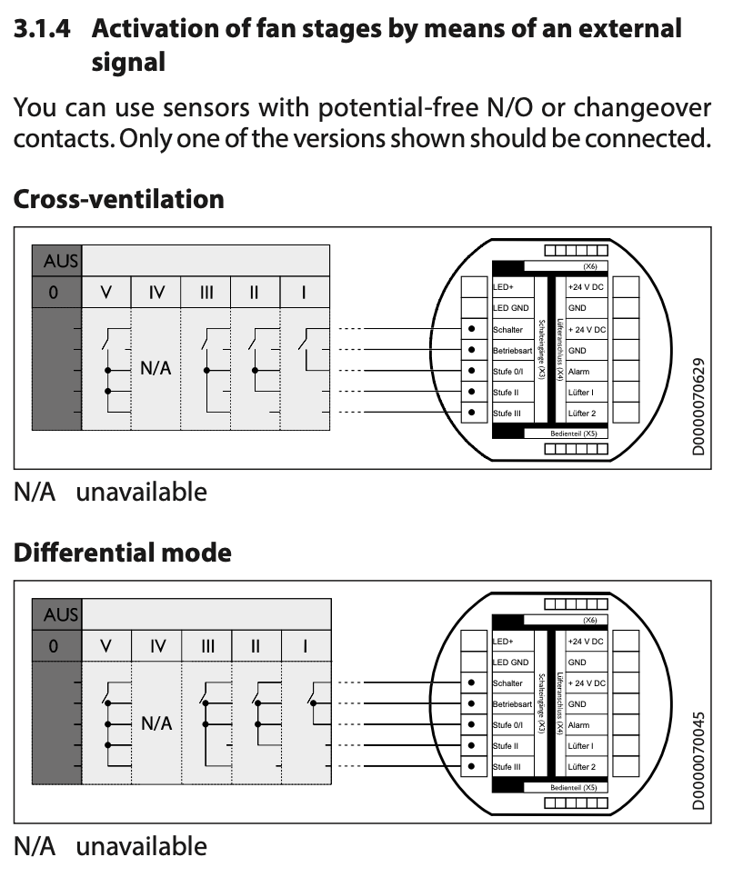

# Ventilation Controller
ESPHome configuration for Tecalor Ventilation

### Required Hardware
- A relay board like this: https://amzn.eu/d/0c0mSOhx
- A length of Cat5/6 cable
- Optional: Electronics box to house the relay board in.

### Flash Esphome using the template
- Obtain a USB to 3.3v TTL serial programmer
- Connect the pins:
  - GND to GND
  - 3.3v to 3.3v on the board (not to 5v pin)
  - TX to RX
  - RX to TX
- Open ESPhome in a Chrome-based browser (Google Chrome / MS Edge)
- Use the ESPhome interface to prepare the board
  - Select Generic ESP32
  - Enter your wifi credentials
  - Upload the initial firmware
  - The board should now appear ONLINE in the ESPhome interface
- Copy the relevant parts of the [ventilation-controller.yaml](https://github.com/yllwfsh/ventilation-controller/blob/main/ventilation-controller.yaml) config to your ESPhome config
- Add the board to Home Assistant
- Switch off the ventilation initially from the Techalor Control panel
- Enjoy controlling the house ventilation from Home Assistant

### Connect the board
Connect the relay board to the Tecalor module:

- Relay 1 NO to 'Betriebsart' pin
- Relay 2 NO to 'Stufe 0/1' pin
- Relay 3 NO to 'Stufe 2' pin
- Relay 4 NO to 'Stufe 3' pin
- All Relays COM terminals together and to 'Schalter' pin
- Use 24V DC and GND from the ventilation power supply to power relay board.

